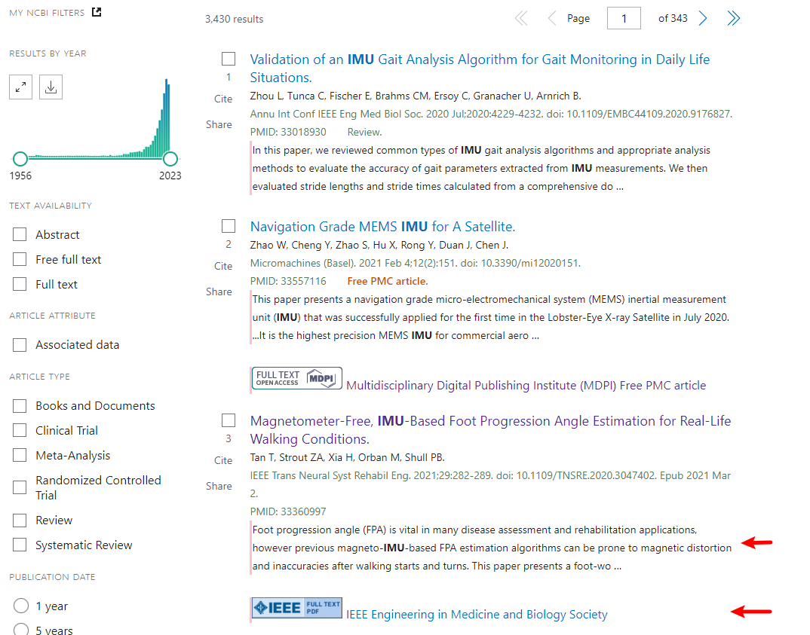
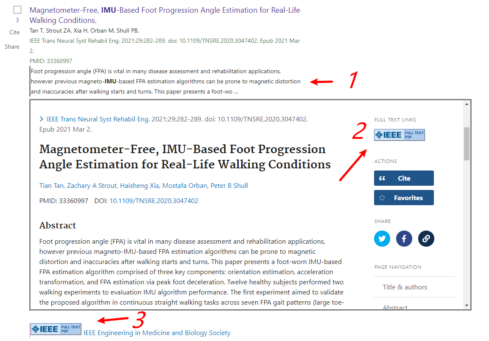

# Chrome/Edge extension for Pubmed Paper Search

The extension enables the extending of search results.
Thus it allows you using two functions in the search page:

1. Read the full page of the paper of interest;
2. Go to the provider for the full article.

## Example

The results are shown as below.
The searching url is https://pubmed.ncbi.nlm.nih.gov/?term=imu#

The extension is already available since it adds the pink bars on the left,
and it adds the full-article links on the bottom of the entries,
moreover, the bottom links are also marked by the pink left bars.

By the way,
if there are not any bottom links is provided, it means the article contains no full-article links.
Just like the 1st entry.

To demonstrate the functional of my extension,
I would like to take the 3rd result for example.

-   To use the function 1,
    you can click the abstract paragraph to extent the page of the article,
    see the
    "1"
    mark.

-   To use the function 2,
    the link marked as
    "3"
    performs the same functionality as the
    "2"
    mark.

